# Architecture Diagram

## System Architecture

```mermaid
graph TB
    %% External Users
    User[👤 Users]
    TelegramUser[👤 Telegram Users]
    
    %% Frontend Layer
    Frontend[🌐 React Frontend<br/>Port 3000]
    TelegramBot[🤖 Telegram Bot]
    
    %% API Gateway Layer
    APIGateway[🚪 API Gateway<br/>Port 8080<br/>HTTP REST]
    
    %% Microservices Layer
    UserService[🔐 User Service<br/>Port 8084<br/>Authentication & Users]
    ContestService[🏆 Contest Service<br/>Port 8085<br/>Contests & Teams]
    PredictionService[🎯 Prediction Service<br/>Port 8086<br/>Predictions & Events]
    ScoringService[📊 Scoring Service<br/>Port 8087<br/>Scores & Leaderboards]
    SportsService[⚽ Sports Service<br/>Port 8088<br/>Sports Data & Sync]
    NotificationService[📢 Notification Service<br/>Port 8089<br/>Multi-channel Notifications]
    
    %% Data Layer
    PostgreSQL[(🗄️ PostgreSQL<br/>Port 5432<br/>Primary Database)]
    Redis[(⚡ Redis<br/>Port 6379<br/>Cache & Sessions)]
    
    %% External Services
    TheSportsDB[🌐 TheSportsDB API<br/>External Sports Data]
    TelegramAPI[📱 Telegram Bot API]
    EmailSMTP[📧 SMTP Server<br/>Email Notifications]
    
    %% User Connections
    User --> Frontend
    User --> APIGateway
    TelegramUser --> TelegramBot
    
    %% Frontend Connections
    Frontend --> APIGateway
    TelegramBot --> UserService
    TelegramBot --> ContestService
    TelegramBot --> ScoringService
    TelegramBot --> NotificationService
    
    %% API Gateway Routing
    APIGateway --> UserService
    APIGateway --> ContestService
    APIGateway --> PredictionService
    APIGateway --> ScoringService
    APIGateway --> SportsService
    APIGateway --> NotificationService
    
    %% Inter-service Communication (gRPC)
    PredictionService -.->|gRPC| ContestService
    ScoringService -.->|gRPC| ContestService
    ScoringService -.->|gRPC| PredictionService
    NotificationService -.->|gRPC| UserService
    
    %% Database Connections
    UserService --> PostgreSQL
    ContestService --> PostgreSQL
    PredictionService --> PostgreSQL
    ScoringService --> PostgreSQL
    SportsService --> PostgreSQL
    NotificationService --> PostgreSQL
    
    %% Cache Connections
    UserService --> Redis
    ContestService --> Redis
    ScoringService --> Redis
    NotificationService --> Redis
    
    %% External API Connections
    SportsService --> TheSportsDB
    TelegramBot --> TelegramAPI
    NotificationService --> EmailSMTP
    
    %% Styling
    classDef frontend fill:#e1f5fe
    classDef gateway fill:#f3e5f5
    classDef service fill:#e8f5e8
    classDef database fill:#fff3e0
    classDef external fill:#fce4ec
    
    class Frontend,TelegramBot frontend
    class APIGateway gateway
    class UserService,ContestService,PredictionService,ScoringService,SportsService,NotificationService service
    class PostgreSQL,Redis database
    class TheSportsDB,TelegramAPI,EmailSMTP external
```

## Service Communication Flow

## Data Flow Architecture

## Network Architecture

## Deployment Architecture

## Security Architecture

## Technology Stack Overview

| Layer | Technology | Purpose |
|-------|------------|---------|
| **Frontend** | React, TypeScript, Material-UI | User interface |
| **API Gateway** | Go, gRPC-Gateway | HTTP/gRPC translation |
| **Microservices** | Go, gRPC | Business logic |
| **Database** | PostgreSQL 15 | Primary data storage |
| **Cache** | Redis 7 | Session & leaderboard cache |
| **Message Queue** | Redis Streams | Async processing |
| **Monitoring** | Prometheus, Grafana | Metrics & alerting |
| **Logging** | Structured JSON logs | Centralized logging |
| **Deployment** | Docker, Kubernetes | Container orchestration |
| **CI/CD** | GitHub Actions | Automated deployment |
| **Security** | JWT, TLS, WAF | Authentication & protection |

---

*These diagrams provide a visual overview of the Sports Prediction Contests platform architecture. For implementation details, refer to the service-specific documentation.*
