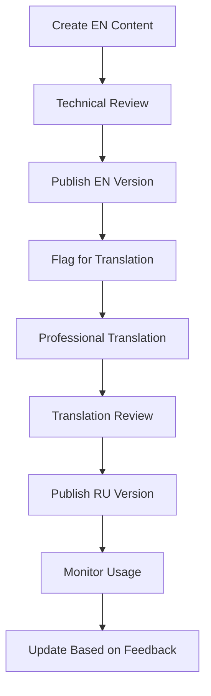

# Multilingual Technical Documentation Best Practices for Microservices Platforms

## Executive Summary

This research document outlines comprehensive best practices for creating multilingual technical documentation for complex microservices platforms, with specific focus on Russian/English bilingual documentation. The recommendations are tailored for the Sports Prediction Contests platform architecture.

## 1. Documentation Structure for Complex Systems

### 1.1 Hierarchical Information Architecture

**Recommended Structure:**
```
docs/
├── README.md                    # Project overview (EN/RU)
├── getting-started/            # Quick start guides
│   ├── en/
│   │   ├── installation.md
│   │   ├── quick-start.md
│   │   └── first-contest.md
│   └── ru/
│       ├── installation.md
│       ├── quick-start.md
│       └── first-contest.md
├── architecture/               # System design
│   ├── en/
│   │   ├── overview.md
│   │   ├── microservices.md
│   │   ├── data-flow.md
│   │   └── security.md
│   └── ru/
├── api/                       # API documentation
│   ├── en/
│   │   ├── openapi.yaml
│   │   ├── grpc-services.md
│   │   └── authentication.md
│   └── ru/
├── deployment/                # Operations guides
│   ├── en/
│   │   ├── docker.md
│   │   ├── kubernetes.md
│   │   └── monitoring.md
│   └── ru/
├── user-guides/              # End-user documentation
│   ├── en/
│   │   ├── contest-creation.md
│   │   ├── predictions.md
│   │   └── leaderboards.md
│   └── ru/
├── developer/                # Developer resources
│   ├── en/
│   │   ├── contributing.md
│   │   ├── testing.md
│   │   └── debugging.md
│   └── ru/
└── troubleshooting/          # Problem resolution
    ├── en/
    └── ru/
```

### 1.2 Content Organization Principles

**1. Progressive Disclosure**
- Start with high-level concepts
- Drill down to implementation details
- Provide multiple entry points for different user types

**2. User Journey Mapping**
```
New Developer → Installation → Quick Start → First API Call
Platform Admin → Architecture → Deployment → Monitoring
End User → Registration → Contest Creation → Making Predictions
```

**3. Cross-Reference System**
- Consistent internal linking
- Related content suggestions
- Breadcrumb navigation

## 2. API Documentation Standards (OpenAPI/Swagger)

### 2.1 OpenAPI 3.0 Specification Structure

**Recommended OpenAPI Structure:**
```yaml
openapi: 3.0.3
info:
  title: Sports Prediction Contests API
  description: |
    Comprehensive API for sports prediction contests platform
    
    ## Language Support
    - English (default)
    - Russian (ru)
    
    Use `Accept-Language` header for localized responses.
  version: 1.0.0
  contact:
    name: API Support
    email: api-support@example.com
  license:
    name: MIT
    url: https://opensource.org/licenses/MIT

servers:
  - url: https://api.sports-contests.com/v1
    description: Production server
  - url: https://staging-api.sports-contests.com/v1
    description: Staging server

paths:
  /contests:
    get:
      summary: List contests
      description: |
        Retrieve a paginated list of contests.
        
        **Russian**: Получить список соревнований с пагинацией.
      operationId: listContests
      parameters:
        - name: Accept-Language
          in: header
          schema:
            type: string
            enum: [en, ru]
            default: en
          description: |
            Language preference for response content.
            
            **Russian**: Предпочтительный язык для содержимого ответа.
```

### 2.2 Multilingual API Documentation Features

**1. Localized Descriptions**
```yaml
components:
  schemas:
    Contest:
      type: object
      properties:
        title:
          type: string
          description: |
            Contest title in the requested language.
            
            **Russian**: Название соревнования на запрашиваемом языке.
          example: "Premier League Predictions"
        description:
          type: string
          description: |
            Detailed contest description.
            
            **Russian**: Подробное описание соревнования.
```

**2. Error Message Localization**
```yaml
components:
  responses:
    ValidationError:
      description: |
        Validation error with localized messages.
        
        **Russian**: Ошибка валидации с локализованными сообщениями.
      content:
        application/json:
          schema:
            type: object
            properties:
              error:
                type: string
                example: "Invalid contest parameters"
              error_ru:
                type: string
                example: "Неверные параметры соревнования"
```

### 2.3 gRPC Documentation Integration

**Proto File Documentation:**
```protobuf
syntax = "proto3";

package contest;

// Contest service provides contest management functionality
// Russian: Сервис соревнований предоставляет функциональность управления соревнованиями
service ContestService {
  // Creates a new contest
  // Russian: Создает новое соревнование
  rpc CreateContest(CreateContestRequest) returns (Contest) {
    option (google.api.http) = {
      post: "/v1/contests"
      body: "*"
    };
  }
}

// Contest represents a sports prediction contest
// Russian: Contest представляет соревнование по спортивным прогнозам
message Contest {
  // Unique contest identifier
  // Russian: Уникальный идентификатор соревнования
  uint32 id = 1;
  
  // Contest title (localized)
  // Russian: Название соревнования (локализованное)
  string title = 2;
}
```

## 3. Deployment Guide Formats

### 3.1 Multi-Environment Documentation Structure

**Docker Deployment Guide:**
```markdown
# Docker Deployment Guide / Руководство по развертыванию Docker

## Prerequisites / Предварительные требования

### English
- Docker 20.10+
- Docker Compose 2.0+
- 4GB RAM minimum
- 10GB disk space

### Russian
- Docker 20.10+
- Docker Compose 2.0+
- Минимум 4ГБ ОЗУ
- 10ГБ дискового пространства

## Quick Start / Быстрый старт

### English
1. Clone the repository:
   ```bash
   git clone https://github.com/sports-prediction-contests/platform
   cd platform
   ```

2. Start services:
   ```bash
   make docker-up
   ```

### Russian
1. Клонируйте репозиторий:
   ```bash
   git clone https://github.com/sports-prediction-contests/platform
   cd platform
   ```

2. Запустите сервисы:
   ```bash
   make docker-up
   ```
```

### 3.2 Environment-Specific Configuration

**Configuration Templates:**
```yaml
# docker-compose.yml
version: '3.8'
services:
  api-gateway:
    image: sports-contests/api-gateway:latest
    environment:
      - DEFAULT_LANGUAGE=en
      - SUPPORTED_LANGUAGES=en,ru
      - LOG_LEVEL=info
    labels:
      - "traefik.enable=true"
      - "traefik.http.routers.api.rule=Host(`api.sports-contests.com`)"
```

### 3.3 Troubleshooting Sections

**Bilingual Troubleshooting Format:**
```markdown
## Common Issues / Распространенные проблемы

### Service Won't Start / Сервис не запускается

**English:**
**Problem:** Container exits with code 1
**Solution:** 
1. Check logs: `docker logs sports-contests-api`
2. Verify environment variables
3. Ensure database is accessible

**Russian:**
**Проблема:** Контейнер завершается с кодом 1
**Решение:**
1. Проверьте логи: `docker logs sports-contests-api`
2. Проверьте переменные окружения
3. Убедитесь, что база данных доступна
```

## 4. Testing Documentation Patterns

### 4.1 Test Documentation Structure

**Comprehensive Testing Guide:**
```markdown
# Testing Guide / Руководство по тестированию

## Test Categories / Категории тестов

### Unit Tests / Модульные тесты
- **English:** Test individual functions and methods
- **Russian:** Тестирование отдельных функций и методов

### Integration Tests / Интеграционные тесты
- **English:** Test service interactions
- **Russian:** Тестирование взаимодействия сервисов

### End-to-End Tests / Сквозные тесты
- **English:** Test complete user workflows
- **Russian:** Тестирование полных пользовательских сценариев
```

### 4.2 Test Case Documentation

**Bilingual Test Case Format:**
```markdown
## Test Case: Contest Creation / Тест-кейс: Создание соревнования

### English
**Objective:** Verify contest creation functionality
**Prerequisites:** 
- User is authenticated
- User has contest creation permissions

**Steps:**
1. Navigate to contest creation page
2. Fill in contest details
3. Submit form
4. Verify contest appears in list

**Expected Result:** Contest is created successfully

### Russian
**Цель:** Проверить функциональность создания соревнования
**Предварительные условия:**
- Пользователь аутентифицирован
- У пользователя есть права на создание соревнований

**Шаги:**
1. Перейти на страницу создания соревнования
2. Заполнить детали соревнования
3. Отправить форму
4. Проверить, что соревнование появилось в списке

**Ожидаемый результат:** Соревнование успешно создано
```

### 4.3 Automated Test Documentation

**Test Configuration Examples:**
```yaml
# test-config.yml
test_suites:
  unit:
    description:
      en: "Unit tests for individual components"
      ru: "Модульные тесты для отдельных компонентов"
    command: "go test ./..."
    
  integration:
    description:
      en: "Integration tests for service interactions"
      ru: "Интеграционные тесты для взаимодействия сервисов"
    command: "make test-integration"
```

## 5. Bilingual Documentation Organization (Russian/English)

### 5.1 Language Selection Strategy

**1. URL-based Language Selection**
```
/docs/en/api/contests
/docs/ru/api/contests
```

**2. File-based Organization**
```
api-reference.en.md
api-reference.ru.md
```

**3. Inline Bilingual Content**
```markdown
# Contest API / API соревнований

## Overview / Обзор

**English:** The Contest API allows you to manage sports prediction contests.

**Russian:** API соревнований позволяет управлять соревнованиями по спортивным прогнозам.
```

### 5.2 Translation Management

**Translation Workflow:**
1. **Source Language:** English (primary)
2. **Translation Process:** 
   - Professional translation for critical content
   - Community translation for extended content
   - Machine translation with human review for rapid updates

**Translation Quality Assurance:**
```markdown
## Translation Guidelines / Руководство по переводу

### Terminology Consistency / Согласованность терминологии
- Contest = Соревнование
- Prediction = Прогноз
- Leaderboard = Таблица лидеров
- Scoring = Подсчет очков

### Style Guide / Руководство по стилю
- Use formal tone in Russian
- Maintain technical accuracy
- Preserve code examples unchanged
```

### 5.3 Content Synchronization

**Automated Sync Process:**
```yaml
# .github/workflows/docs-sync.yml
name: Documentation Sync
on:
  push:
    paths: ['docs/en/**']
    
jobs:
  sync-translations:
    runs-on: ubuntu-latest
    steps:
      - name: Check translation status
        run: |
          # Compare EN and RU file timestamps
          # Flag outdated translations
          # Create translation tasks
```

## 6. Interactive Examples and Troubleshooting Sections

### 6.1 Interactive API Examples

**Code Playground Integration:**
```markdown
## Interactive API Example / Интерактивный пример API

### Create Contest / Создать соревнование

**English:**
Try this API call in our interactive playground:

```javascript
// Interactive code block with live execution
const response = await fetch('/api/v1/contests', {
  method: 'POST',
  headers: {
    'Content-Type': 'application/json',
    'Accept-Language': 'en'
  },
  body: JSON.stringify({
    title: 'Premier League Predictions',
    sport_type: 'football',
    start_date: '2024-02-01T00:00:00Z'
  })
});
```

**Russian:**
Попробуйте этот API-вызов в нашей интерактивной среде:

```javascript
// Интерактивный блок кода с живым выполнением
const response = await fetch('/api/v1/contests', {
  method: 'POST',
  headers: {
    'Content-Type': 'application/json',
    'Accept-Language': 'ru'
  },
  body: JSON.stringify({
    title: 'Прогнозы Премьер-лиги',
    sport_type: 'football',
    start_date: '2024-02-01T00:00:00Z'
  })
});
```
```

### 6.2 Troubleshooting Decision Trees

**Interactive Troubleshooting Format:**
```markdown
## Troubleshooting Wizard / Мастер устранения неполадок

### Problem: API Returns 500 Error / Проблема: API возвращает ошибку 500

**English:**
1. **Is the service running?**
   - ✅ Yes → Go to step 2
   - ❌ No → [Start the service](#starting-services)

2. **Are database connections working?**
   - ✅ Yes → Go to step 3
   - ❌ No → [Check database connectivity](#database-troubleshooting)

3. **Check application logs**
   ```bash
   docker logs sports-contests-api --tail 100
   ```

**Russian:**
1. **Запущен ли сервис?**
   - ✅ Да → Перейти к шагу 2
   - ❌ Нет → [Запустить сервис](#starting-services)

2. **Работают ли подключения к базе данных?**
   - ✅ Да → Перейти к шагу 3
   - ❌ Нет → [Проверить подключение к БД](#database-troubleshooting)

3. **Проверить логи приложения**
   ```bash
   docker logs sports-contests-api --tail 100
   ```
```

### 6.3 Diagnostic Tools Integration

**Health Check Documentation:**
```markdown
## System Health Checks / Проверки состояния системы

### Automated Diagnostics / Автоматическая диагностика

**English:**
Run the built-in diagnostic tool:
```bash
make health-check
```

This will check:
- Service connectivity
- Database status
- Redis cache
- External API availability

**Russian:**
Запустите встроенный инструмент диагностики:
```bash
make health-check
```

Это проверит:
- Подключение к сервисам
- Состояние базы данных
- Кэш Redis
- Доступность внешних API
```

## 7. Implementation Recommendations

### 7.1 Documentation Toolchain

**Recommended Tools:**
1. **Static Site Generator:** GitBook, Docusaurus, or VitePress
2. **API Documentation:** Swagger UI with i18n support
3. **Translation Management:** Crowdin or Lokalise
4. **Version Control:** Git with branch-per-language strategy

### 7.2 Content Management Workflow

**Documentation Lifecycle:**


### 7.3 Quality Metrics

**Documentation KPIs:**
- Translation coverage percentage
- Content freshness (days since last update)
- User engagement metrics
- Support ticket reduction
- API adoption rates by language

### 7.4 Maintenance Strategy

**Regular Maintenance Tasks:**
1. **Weekly:** Check for outdated translations
2. **Monthly:** Review user feedback and analytics
3. **Quarterly:** Comprehensive content audit
4. **Annually:** Translation quality assessment

## 8. Conclusion

Implementing comprehensive multilingual documentation for a microservices platform requires:

1. **Structured approach** to content organization
2. **Consistent translation** processes and quality control
3. **Interactive elements** to enhance user experience
4. **Automated workflows** for maintenance and synchronization
5. **User-centric design** with clear navigation and search

The key to success is treating documentation as a product with its own development lifecycle, user research, and continuous improvement process.

## 9. Next Steps

1. **Audit existing documentation** against these best practices
2. **Implement bilingual structure** starting with critical user journeys
3. **Set up translation workflow** with quality gates
4. **Create interactive examples** for key API endpoints
5. **Establish metrics and feedback loops** for continuous improvement

This comprehensive approach will ensure that both English and Russian-speaking users have access to high-quality, maintainable technical documentation that scales with the platform's growth.